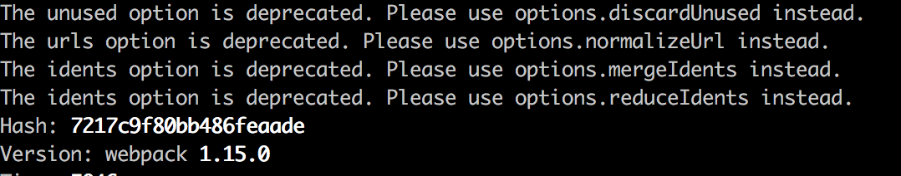

# css-loader unused warnging
> The urls option is deprecated. Please use options.normalizeUrl instead

## snapshot

## resolution:
+ remove 'css-loader' from 'package.json';
+ reinstall: 'css-loader' latest version
